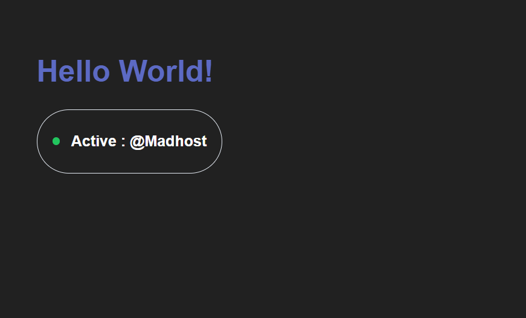

# <template> HTML Tag

The `<template>` tag is an HTML mechanism for holding client-side markup that is parsed but **not rendered** when the page loads. It serves as an inert blueprint that can be cloned and stamped into the DOM via JavaScript.

---

### view



### Core Mechanics: Why `<template>` Exists

Prior to `<template>`, developers hid HTML fragments using hidden `<div>` tags or string templates inside `<script type="text/template">`:

* Hidden `<div>` elements still evaluate resources: `` fetches immediately, `<audio>` loads, and CSS applies in the background.
* String templates lack syntax checking and require costly parsing every time they are converted to nodes via `innerHTML`.

`<template>` solves this by holding an inert `DocumentFragment`:

* **Inert content:** Scripts do not execute, styles do not apply, and external media (``, `<video>`, `<iframe>`) do not download until stamped.
* **Parsed once:** The browser validates and tokenizes the HTML structure upfront.
* **Lightweight cloning:** Node operations clone the parsed structure without reparsing HTML strings.

---

### The `content` Property and `importNode`

A template's markup lives inside a property called `.content`, which references an instance of `DocumentFragment`.

```html
<template id="card-blueprint">
  <div class="card">
    <h3 class="card-title"></h3>
    <p class="card-body"></p>
  </div>
</template>

<div id="container"></div>

<script>
  const template = document.getElementById('card-blueprint');
  const container = document.getElementById('container');

  function renderCard(title, text) {
    // Clone the inert DocumentFragment (true = deep clone with all children)
    const clone = document.importNode(template.content, true);

    // Populate data
    clone.querySelector('.card-title').textContent = title;
    clone.querySelector('.card-body').textContent = text;

    // Stamp into live DOM
    container.appendChild(clone);
  }

  renderCard('First Title', 'This is content for card 1.');
  renderCard('Second Title', 'This is content for card 2.');
</script>

```

> **`document.importNode` vs `node.cloneNode`:** Both work for cloning template content. `document.importNode(template.content, true)` explicitly handles ownership if importing nodes across different document contexts (such as an iframe or external document). For standard single-page usage, `template.content.cloneNode(true)` is functionally identical.

---

### Using `<template>` in Custom Web Components

In Web Components, `<template>` pairs directly with **Shadow DOM** to create isolated, reusable components with scoped styles.

#### 1. Internal Template (Component-Level Definition)

Defining the template once in JavaScript or directly in HTML allows all instances of a custom element to stamp their Shadow DOM from a single cached blueprint.

```javascript
// Define the blueprint once
const userBadgeTemplate = document.createElement('template');
userBadgeTemplate.innerHTML = `
  <style>
    :host {
      display: inline-flex;
      align-items: center;
      gap: 0.75rem;
      padding: 0.5rem 1rem;
      border: 1px solid #e2e8f0;
      border-radius: 9999px;
      font-family: sans-serif;
    }
    .status-dot {
      width: 8px;
      height: 8px;
      border-radius: 50%;
      background-color: #22c55e;
    }
    .name {
      font-weight: 600;
      color: #1e293b;
    }
  </style>

  <span class="status-dot"></span>
  <span class="name"><slot>Anonymous</slot></span>
`;

class UserBadge extends HTMLElement {
  constructor() {
    super();
    // Attach an isolated Shadow Root
    this.attachShadow({ mode: 'open' });
    
    // Stamp the template clone directly into the Shadow DOM
    this.shadowRoot.appendChild(userBadgeTemplate.content.cloneNode(true));
  }
}

customElements.define('user-badge', UserBadge);

```

Usage in HTML:

```html
<user-badge>Sarah Connor</user-badge>
<user-badge></user-badge> <!-- Uses fallback: Anonymous -->

```

---

#### 2. Declarative Shadow DOM (DSD)

Modern browsers support attaching Shadow DOM directly from HTML without relying on `this.attachShadow()` or JavaScript execution during initial page render. This is critical for Server-Side Rendering (SSR).

Use `<template shadowrootmode="open">` (or `"closed"`):

```html
<profile-card>
  <template shadowrootmode="open">
    <style>
      .badge {
        padding: 0.25rem 0.5rem;
        background: #f1f5f9;
        border-radius: 4px;
      }
    </style>
    <div class="badge">
      <slot name="role">Member</slot>
    </div>
  </template>

  <!-- Light DOM slotted content -->
  <span slot="role">Admin</span>
</profile-card>

```

When the browser parses `<template shadowrootmode="open">`, it automatically creates the element's Shadow Root and stamps the template content directly inside it before the JavaScript engine even defines the custom element.

---

### Key Takeaways & Best Practices

* **Always clone, never move:** Never run `container.appendChild(template.content)` directly without `.cloneNode(true)` or `document.importNode()`. Appending `.content` directly moves the nodes, emptying the template and leaving nothing for future stamps.
* **Slots and Templates:** Templates define the internal structure (Shadow DOM), while `<slot>` elements define injection points for the light DOM supplied by the consumer.
* **Performance:** Reusing a single parsed `<template>` avoids repeated string parsing via `innerHTML` across multiple component instances.

## How to Run the Project

A simple Standard Web Component Project built using HTML, CSS, and JavaScript.

### Files

- index.html — Main HTML file
- style.css — Styling
- script.js — JavaScript functionality
- image.png — Image of project

### How to Run

Download or clone this repository. Open `index.html` in any web browser.
The project will run directly in the browser.

No installation or server is required.