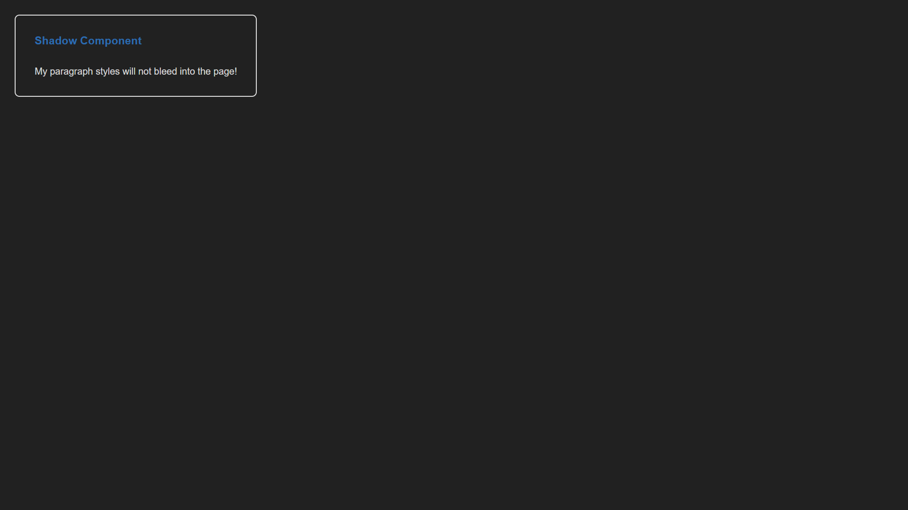

# How to Run the Project

A simple Standard Web Component Project built using HTML, CSS, and JavaScript.

### view

## Files

- index.html — Main HTML file
- style.css — Styling
- script.js — JavaScript functionality
- image.png — Image of project

## How to Run

Download or clone this repository. Open `index.html` in any web browser.
The project will run directly in the browser.

No installation or server is required.